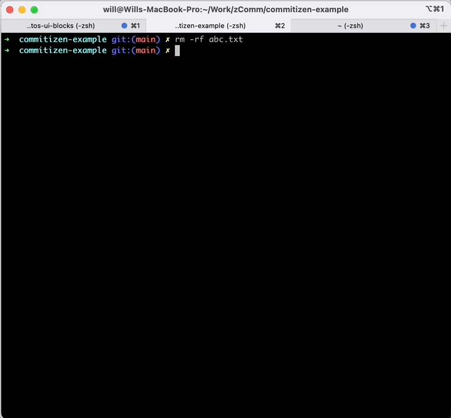

# commitizen, commitlint, husky examples

`Husky`, `Commitlint`, and `Commitizen` are popular tools used in software development, particularly in projects that follow the Git version control system and adhere to commit message conventions.

| Tool | Comments |
|:--|:--
| Commitlint | enforce commit message conventions in a Git repository, it integrates with Git hooks |
| Husky | allows you to add Git hooks in your project to enforce certain rules or execute custom scripts (e.g. Commit message conventions check) |
| Commitizen | a command-line utility that helps you create commit messages following the conventional commit format |

## Get started

```
# Install dependencies and init husky
npm install & npm run prepare

# Create a git hook for commitlint
npx husky add .husky/commit-msg 'npx --no -- commitlint --edit "$1"'

# Create a git hook for test
npx husky add .husky/pre-commit "npm test" & git add .husky/pre-commit
```

## Try a commit message not following the conventional commit format

```
touch abc.txt
git add abc.txt
git commit -m "foo"
```

See how `Husky` & `Commitlint` work together to prevent you from committing a message not following the conventional commit format.

